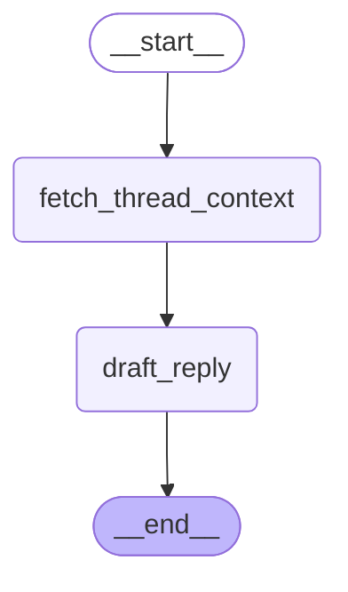

# Reply Drafter Agent - Workflow Visualization

**Description:** Drafts email replies based on thread context

## Graph Structure

## State Schema

| Field | Type | Optional |
|-------|------|----------|
| `email_id` | `<class 'int'>` | No |
| `thread_emails` | `List[dict]` | No |
| `thread_context` | `<class 'str'>` | No |
| `draft` | `<class 'str'>` | No |
| `feedback` | `str` | Yes |
| `tone` | `str` | Yes |
| `previous_draft` | `str` | Yes |
| `thread_id` | `<class 'str'>` | No |
| `recipient` | `<class 'str'>` | No |
| `subject` | `<class 'str'>` | No |

