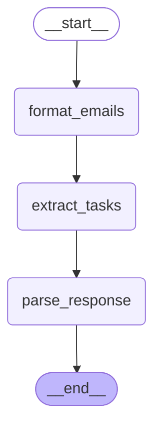

# Task Extractor Agent - Workflow Visualization

**Description:** Extracts actionable tasks from unread emails

## Graph Structure

## State Schema

| Field | Type | Optional |
|-------|------|----------|
| `emails` | `List[dict]` | No |
| `emails_text` | `<class 'str'>` | No |
| `raw_response` | `<class 'str'>` | No |
| `tasks` | `ActionItem]` | No |

